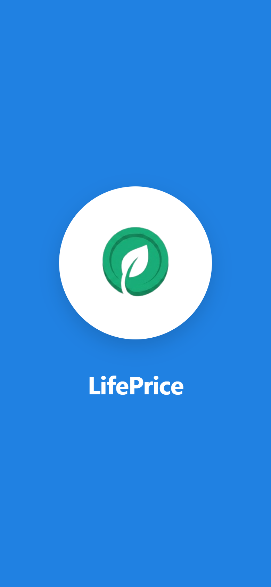
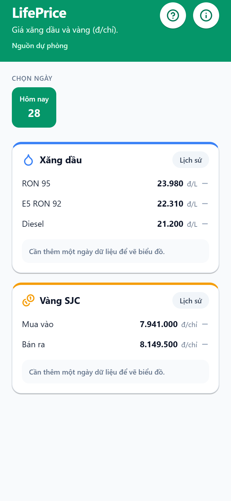
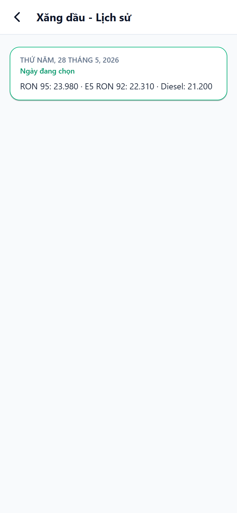
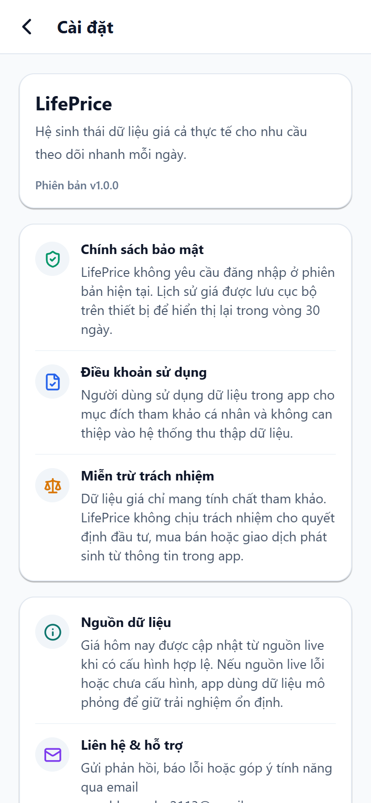

# LifePrice


LifePrice là ứng dụng di động giúp theo dõi nhanh giá xăng dầu và giá vàng SJC theo từng ngày. App ưu tiên trải nghiệm gọn, dễ xem trên điện thoại: mở app là thấy giá hôm nay, xu hướng tăng/giảm, biểu đồ ngắn hạn và lịch sử các ngày đã lưu.

<p align="center">
  
</p>

## Mục Lục

- [Tổng quan](#tổng-quan)
- [Tính năng chính](#tính-năng-chính)
- [Ảnh màn hình](#ảnh-màn-hình)
- [Công nghệ sử dụng](#công-nghệ-sử-dụng)
- [Luồng dữ liệu](#luồng-dữ-liệu)
- [Cấu trúc thư mục](#cấu-trúc-thư-mục)
- [Cài đặt và chạy dự án](#cài-đặt-và-chạy-dự-án)
- [Biến môi trường](#biến-môi-trường)
- [Scripts](#scripts)
- [Ghi chú phát triển](#ghi-chú-phát-triển)

## Tổng Quan

| Thông tin | Mô tả |
| --- | --- |
| Tên app | LifePrice |
| Nền tảng | Android, iOS, Web thông qua Expo |
| Framework | Expo Router + React Native |
| Ngôn ngữ | TypeScript |
| Styling | NativeWind / Tailwind CSS |
| Dữ liệu chính | Giá xăng dầu, giá vàng SJC |
| Lưu trữ cục bộ | AsyncStorage |
| Đồng bộ cloud | Supabase `price_snapshots` |
| Crawl dữ liệu | Firecrawl API, có fallback mock data |

## Tính Năng Chính

### Giá xăng dầu

- Hiển thị các loại giá phổ biến như RON 95, E5 RON 92 và Diesel.
- Hỗ trợ cấu hình vùng giá Petrolimex:
  - `1`: Vùng 1.
  - `2`: Vùng 2.
- Có icon xu hướng tăng, giảm hoặc không đổi so với snapshot trước đó.

### Giá vàng SJC

- Hiển thị giá mua vào và bán ra.
- Dữ liệu lưu theo đơn vị `VND/lượng`.
- App chuyển đổi để hiển thị thân thiện theo `VND/chỉ`.

### Dashboard theo ngày

- Chọn ngày bằng thanh date chip.
- Luôn có ngày hôm nay trong danh sách.
- Hiển thị các ngày có snapshot đã lưu trong vòng 30 ngày.

### Lịch sử và biểu đồ

- Mỗi nhóm giá có màn hình lịch sử riêng.
- Biểu đồ mini hiển thị xu hướng ngắn hạn dựa trên snapshot đã lưu.
- Nếu chưa đủ dữ liệu, app hiển thị trạng thái trống thay vì vẽ biểu đồ sai.

### Onboarding

- Màn hướng dẫn lần đầu dùng app.
- Giới thiệu nhanh:
  - Giá xăng dầu.
  - Giá vàng SJC.
  - Lịch sử và biểu đồ.
- Trạng thái đã xem onboarding được lưu bằng AsyncStorage.

### Splash screen và branding

- Có màn splash riêng với logo LifePrice.
- Icon app, adaptive icon Android và favicon web nằm trong `assets/images`.

### Auth demo

- Có màn đăng nhập / đăng ký mô phỏng.
- Hiện tại chưa kết nối backend auth thật.
- Dùng để kiểm tra UX form tài khoản.

## Ảnh Màn Hình

Các screenshot nằm trong thư mục `docs/screenshots-lifeprice`.

<p align="center">
  
  
  
  
</p>

| Màn hình | File |
| --- | --- |
| Splash screen | `docs/screenshots-lifeprice/01-splash-screen.png` |
| Onboarding giá xăng dầu | `docs/screenshots-lifeprice/02-onboarding-gia-xang-dau.png` |
| Onboarding giá vàng SJC | `docs/screenshots-lifeprice/03-onboarding-gia-vang-sjc.png` |
| Onboarding lịch sử / biểu đồ | `docs/screenshots-lifeprice/04-onboarding-lich-su-bieu-do.png` |
| Dashboard home | `docs/screenshots-lifeprice/05-dashboard-home.png` |
| Lịch sử xăng dầu | `docs/screenshots-lifeprice/06-history-xang-dau.png` |
| Lịch sử vàng SJC | `docs/screenshots-lifeprice/07-history-vang-sjc.png` |
| About / settings | `docs/screenshots-lifeprice/08-about-settings.png` |
| Auth demo | `docs/screenshots-lifeprice/09-auth-demo.png` |

## Công Nghệ Sử Dụng

### Core

- **Expo `~54.0.33`**: chạy app React Native đa nền tảng.
- **React Native `0.81.5`**: xây UI mobile native.
- **React `19.1.0`**: nền tảng component.
- **TypeScript `~5.9.2`**: type safety cho codebase.
- **Expo Router `~6.0.23`**: routing theo file trong thư mục `app`.

### UI / UX

- **NativeWind `^4.2.3`**: viết style bằng class Tailwind trong React Native.
- **Tailwind CSS `^3.4.19`**: cấu hình token/style.
- **lucide-react-native `^1.14.0`**: icon cho dashboard, settings, onboarding.
- **@expo/vector-icons `^15.0.3`**: bộ icon Expo.
- **react-native-svg `15.12.1`**: vẽ biểu đồ trend mini.
- **react-native-reanimated `~4.1.1`**: animation cho onboarding.
- **react-native-gesture-handler / screens / safe-area-context**: hỗ trợ navigation và layout mobile.

### Data / Storage

- **@react-native-async-storage/async-storage `2.2.0`**: cache snapshot giá và trạng thái onboarding.
- **@supabase/supabase-js `^2.105.4`**: đồng bộ snapshot lịch sử từ Supabase.
- **react-native-url-polyfill `^3.0.0`**: polyfill URL cho Supabase trong React Native.
- **Firecrawl API**: crawl giá live từ nguồn web khi có cấu hình.

### Build / Config

- **EAS Build**: cấu hình trong `eas.json`.
- **Expo Splash Screen**: cấu hình splash trong `app.json`.
- **ESLint Expo**: lint code bằng `expo lint`.

## Luồng Dữ Liệu

LifePrice đang đi theo hướng Supabase là nguồn lịch sử chính, còn app mobile đọc và cache dữ liệu để hiển thị nhanh.

```txt
Nguồn giá trên web
 -> Firecrawl scrape
 -> parse / normalize
 -> Supabase price_snapshots
 -> app sync về AsyncStorage
 -> dashboard, history, chart
```

Khi mở app:

1. App xóa snapshot cục bộ quá cũ, mặc định giữ 30 ngày.
2. Nếu có cấu hình Supabase, app tải tối đa 30 snapshot mới nhất từ bảng `price_snapshots`.
3. Snapshot remote được lưu vào AsyncStorage.
4. Dashboard render từ snapshot đã lưu.
5. Nếu là ngày hôm nay và có cấu hình Firecrawl, app thử lấy giá live.
6. Nếu thiếu cấu hình hoặc lấy live thất bại, app dùng mock data để trải nghiệm vẫn chạy được.

Ghi chú chi tiết hơn nằm ở `docs/data-pipeline-notes.md`.

## Cấu Trúc Thư Mục

```txt
myapp/
├─ app/
│  ├─ _layout.tsx              # Root layout của Expo Router
│  ├─ index.tsx                # Splash/loading screen
│  ├─ home.tsx                 # Dashboard chính
│  ├─ auth.tsx                 # Auth demo
│  ├─ about.tsx                # Settings/about/legal notes
│  └─ history/[kind].tsx       # Lịch sử giá theo nhóm fuel/gold
├─ components/
│  ├─ DateSelector.tsx         # Chọn ngày
│  ├─ OnboardingOverlay.tsx    # Modal onboarding
│  ├─ PriceCard.tsx            # Card giá xăng/vàng
│  └─ TrendChart.tsx           # Biểu đồ mini SVG
├─ lib/
│  ├─ goldChi.ts               # Chuyển đổi vàng lượng -> chỉ
│  ├─ livePrices.ts            # Firecrawl + parse dữ liệu live
│  ├─ priceMocks.ts            # Mock data và helper format
│  ├─ priceSnapshots.ts        # AsyncStorage snapshots/history/chart
│  ├─ remoteSnapshots.ts       # Sync Supabase -> AsyncStorage
│  └─ supabase.ts              # Supabase client
├─ assets/images/              # Logo, icon, splash, favicon
├─ docs/
│  ├─ data-pipeline-notes.md
│  └─ screenshots-lifeprice/
├─ scripts/
│  └─ sync-daily-prices.mjs    # Script đồng bộ giá hằng ngày
├─ app.json                    # Expo config
├─ eas.json                    # EAS Build config
├─ package.json
└─ README.md
```

## Cài Đặt Và Chạy Dự Án

### Yêu cầu

- Node.js bản LTS.
- npm.
- Expo CLI, có thể chạy qua `npx expo`.
- Android Studio hoặc Xcode nếu muốn chạy emulator/simulator.
- Expo Go nếu muốn test nhanh trên điện thoại thật.

### Cài dependencies

```bash
npm install
```

### Tạo file môi trường

PowerShell:

```powershell
Copy-Item .env.example .env
```

Bash/macOS/Linux:

```bash
cp .env.example .env
```

Sau đó điền các biến cần thiết trong `.env`. Nếu chưa có Supabase hoặc Firecrawl, app vẫn chạy bằng mock data.

### Chạy app

```bash
npm start
```

Chạy riêng từng nền tảng:

```bash
npm run android
npm run ios
npm run web
```

## Biến Môi Trường

Expo chỉ expose biến có prefix `EXPO_PUBLIC_` vào client app.

| Biến | Bắt buộc | Mục đích |
| --- | --- | --- |
| `EXPO_PUBLIC_FIRECRAWL_API_KEY` | Không | API key để crawl dữ liệu live bằng Firecrawl |
| `EXPO_PUBLIC_PRICE_URL_FUEL` | Không | URL nguồn giá xăng dầu |
| `EXPO_PUBLIC_PRICE_URL_GOLD` | Không | URL nguồn giá vàng |
| `EXPO_PUBLIC_FUEL_PRICE_REGION` | Không | Vùng giá xăng dầu, `1` hoặc `2` |
| `EXPO_PUBLIC_SUPABASE_URL` | Không | Supabase project URL |
| `EXPO_PUBLIC_SUPABASE_ANON_KEY` | Không | Supabase anon public key |

Không đưa service role key vào app mobile. Nếu dùng job tự động hoặc script server-side, key nhạy cảm nên nằm trong GitHub Secrets hoặc môi trường backend.

## Scripts

| Lệnh | Mô tả |
| --- | --- |
| `npm start` | Mở Expo Dev Server |
| `npm run android` | Chạy app Android |
| `npm run ios` | Chạy app iOS |
| `npm run web` | Chạy bản web |
| `npm run lint` | Kiểm tra lint bằng Expo ESLint |
| `npm run sync:prices` | Chạy script đồng bộ giá hằng ngày |

## Ghi Chú Phát Triển

### Quy ước dữ liệu snapshot

Snapshot local dùng key dạng:

```txt
lifeprice:snap:v1:YYYY-MM-DD
```

Payload gồm:

```ts
type StoredSnapshot = {
  v: 1;
  fuel: DashboardPrices["fuel"];
  gold: DashboardPrices["gold"];
  savedAt: string;
  source: "live" | "mock" | "mixed";
};
```

### Supabase table đề xuất

```sql
create table if not exists public.price_snapshots (
  date date primary key,
  fuel jsonb not null,
  gold jsonb not null,
  source text,
  fetched_at timestamptz default now()
);
```

### Những điểm cần nhớ

- App giữ lịch sử local trong khoảng 30 ngày.
- Chart chỉ vẽ khi có ít nhất 2 điểm dữ liệu thật.
- Giá vàng nên lưu theo `VND/lượng`, app tự đổi ra `VND/chỉ` khi hiển thị.
- Firecrawl trong client chỉ phù hợp demo/local. Bản production nên đưa crawl và parse sang backend hoặc GitHub Actions.
- Auth hiện tại là demo UI, chưa tạo session người dùng thật.

## Hướng Phát Triển Tiếp Theo

- Thêm GitHub Actions chạy định kỳ để ghi snapshot vào Supabase.
- Thêm chế độ dry-run cho pipeline crawl giá.
- Validate giá trước khi lưu để tránh dữ liệu sai bất thường.
- Bổ sung fallback source cho xăng dầu và vàng.
- Kết nối auth thật nếu app cần tài khoản người dùng.
- Thêm test cho parser giá và logic snapshot.

## Tác Giả

LifePrice được xây dựng bởi `hoangbo2113`.

Liên hệ góp ý / báo lỗi: `quachhoangbo2113@gmail.com`
